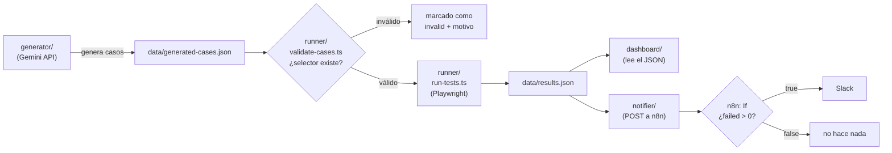

# QA Pipeline con IA

Pipeline de QA automatizado que usa un LLM para generar casos de prueba,
pero **valida cada selector contra el DOM real antes de ejecutar nada** —
para no confundir "el test está mal escrito" con "la app está rota".

## El problema

Los pipelines de QA con IA suelen generar test cases automáticamente a
partir de una especificación. El problema: un LLM puede alucinar un
selector que no existe en la página. Si nadie lo valida antes de correr
el test, el resultado es un timeout confuso de Playwright — y quien lo
lee no sabe si falló la app o si el test estaba mal escrito de entrada.

Este pipeline separa esos dos problemas en capas explícitas:

1. **¿El JSON que devolvió la IA tiene la forma correcta?** (`generator/`)
2. **¿Los selectores que usa existen de verdad en el DOM?** (`runner/`)
3. **Recién ahí, ¿el test pasa o falla?** (`runner/`)

Si un caso falla en el paso 1 o 2, queda marcado como inválido con el
motivo exacto — nunca llega a ejecutarse ni genera una falla ambigua.

## Arquitectura



## Decisiones de diseño

- **Sin agente autónomo de navegador** (tipo Playwright MCP) — el
  diferencial de este proyecto es justamente la validación explícita
  *antes* de ejecutar, no delegarle el control total a la IA.
- **`playwright` "pelado" en vez de `@playwright/test`** en todo
  `runner/` — mezclar dos formas de manejar Playwright (una para
  validar, otra para correr con un framework de tests distinto) suma
  complejidad sin necesidad real acá.
- **La decisión de "esto amerita alerta en Slack" vive en n8n, no en el
  código.** `notifier/` siempre manda el resumen completo; la lógica de
  qué hacer con eso es una rama condicional visible en el workflow, no
  un `if` escondido en TypeScript.
- **`data/results.json` es un archivo plano, append-only.** Sin base de
  datos — para el volumen y el propósito de este proyecto, sumar
  infraestructura ahí sería sobre-ingeniería.
- **El webhook de n8n corre sin autenticación.** Es correcto mientras
  todo esté en `localhost` (nadie de afuera puede alcanzarlo); para un
  deploy real, correspondería sumar Header Auth.

## Estructura

```
qa-ai-pipeline/
├── shared/       # Tipos TypeScript compartidos por todo el resto
├── target-app/   # La app bajo prueba (Vite + TS, form de registro)
├── generator/    # Genera test cases con un LLM (Gemini)
├── runner/       # Valida selectores y ejecuta con Playwright
├── notifier/     # Envía el resumen de cada corrida a n8n
├── dashboard/    # Lee data/results.json y muestra el historial
└── data/         # cases.json, generated-cases.json, results.json
```

## Cómo correrlo

Requisito: Node.js 18+.

### 1. Levantar la app bajo prueba

```bash
cd target-app
npm install
npm run dev
```

Queda escuchando en `http://localhost:5173`.

### 2. Validar y correr los casos de prueba

En otra terminal:

```bash
cd runner
npm install
npx playwright install chromium   # solo la primera vez
npm run validate   # chequea que los selectores existan, sin ejecutar nada
npm run test        # ejecuta de verdad y guarda en data/results.json
```

### 3. Ver el dashboard

Desde la raíz del proyecto (no desde `dashboard/`, para que pueda leer
`data/`):

```bash
npx serve .
```

Abrir `http://localhost:3000/dashboard/`.

### 4. Generar casos nuevos con IA

```bash
cd generator
npm install
cp .env.example .env   # completar GEMINI_API_KEY (gratis, sin tarjeta)
npm run generate
```

Los casos generados quedan en `data/generated-cases.json`, separados de
los casos de control en `data/cases.json`. Para validarlos/correrlos sin
tocar los de control:

```bash
# desde runner/
CASES_FILE=generated-cases.json npm run validate
CASES_FILE=generated-cases.json npm run test
```

### 5. Notificar a Slack vía n8n

Requiere una instancia de n8n corriendo con el workflow armado (Webhook
→ If → Slack). Con eso levantado:

```bash
cd notifier
npm install
cp .env.example .env   # completar N8N_WEBHOOK_URL
npm run notify
```

## Estado conocido

Honesto sobre lo que falta o tiene una limitación conocida:

- El mensaje de Slack llega con algunas variables vacías — pendiente de
  revisar la configuración de expresiones en el nodo de n8n.
- La API de Gemini está devolviendo un error 403 conocido y reportado
  por otros usuarios en proyectos nuevos — parece un bug del lado de
  Google, no de este proyecto; se resuelve solo o se puede migrar a
  otro proveedor (el cambio es chico, ver `generator/src/generate-cases.ts`).
- El dashboard muestra el `data/results.json` local — para que "viva"
  en un deploy público necesitaría un job programado que corra los
  tests y actualice el archivo periódicamente (no implementado).

## Stack

Node.js, TypeScript, Playwright, Vite, Google Gemini API, n8n, Slack.
